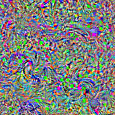
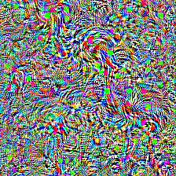

# Optimizing noise into class model learned representations

This repository is a reproduction of the Class Model Visualization neural network interpretability technique proposed in [*Deep Inside Convolutional Networks: Visualising Image Classification Models and Saliency Maps* by Simonyan et al.](https://arxiv.org/abs/1312.6034). The model is describes as follows:
> [...] Let $S_c(I)$ be the score of the class $c$, computed by the classification layer of the ConvNet for an image $I$. We would like to find an $L_2$-regularised image, such that the score $S_c$ is high: $$arg\ \underset{I}{max}\ S_c(I)-\lambda\lVert I \rVert^2_2,$$where $\lambda$ is the regularisation parameter. A locally-optimal $I$ can be found by the back-propagation method. The procedure is related to the ConvNet training procedure, where the back-propagation is used to optimise the layer weights. The difference is that in our case the optimisation is performed with respect to the input image, while the weights are fixed to those found during the training stage. We initialised the optimisation with the zero image (in our case, the ConvNet was trained on the zero-centred image data), and then added the training set mean image to the result

To enact this, **stochastic gradient ascent** is performed on the designated class we wish to visualize. This will tune the input image to result in the highest yielding activation for that prediction in the classifier's output layer. More rigorously, the entire process can be summarized by the following: $$I_k \rightarrow I'_k = I_k+\frac{\eta}{m}\sum_j\frac{\partial{S_c(I)}}{\partial{I_k}}$$

## Configuring your model

    
    
     
    <figcaption align = "center"><b>Black Swan and Flamingo classes visualized, after 150 gradient updates.</b></figcaption>

The most accessible parameters to be configured are: the amount of iterations, the learning rate, and the logit class to be optimized. Feel free to tinker with anything, though, whether it be one of the above or something more specific to the model's training process like the optimization function. Happy coding! ❤️
